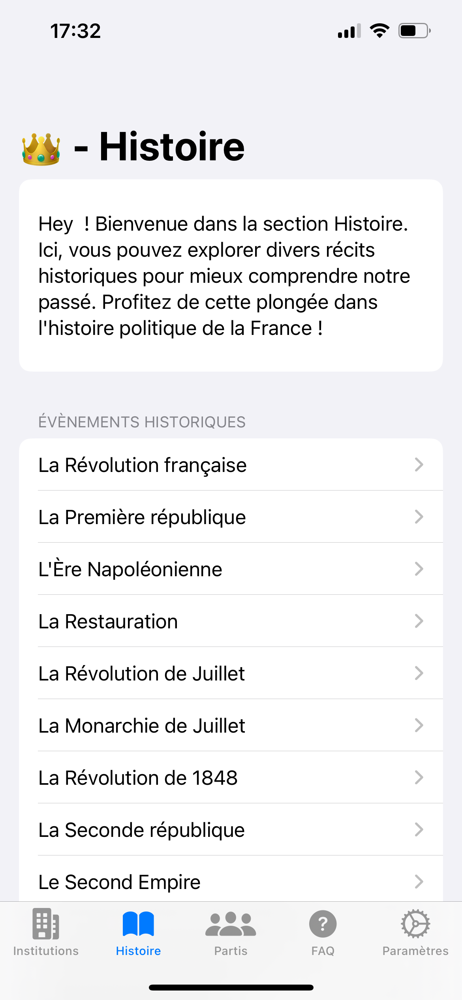
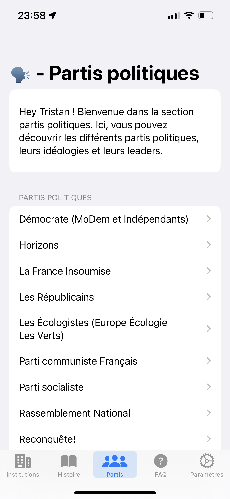
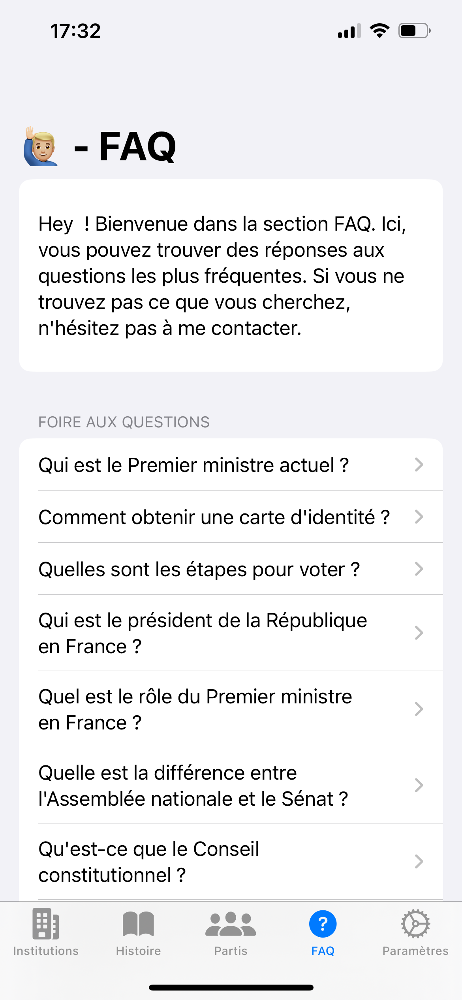
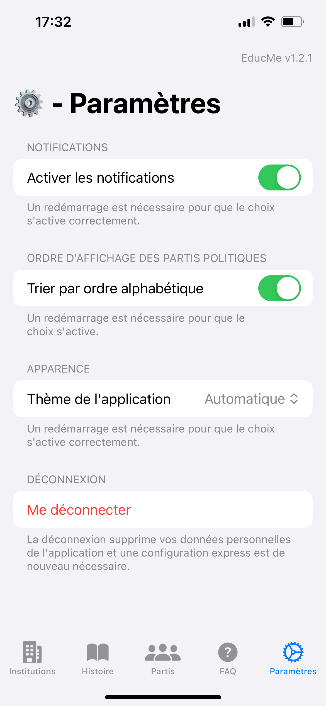

# 🎓 EducMe - Explorez, apprenez, engagez-vous !

## Objectif de l'application
L'application vise à fournir une plateforme interactive et éducative pour les utilisateurs français, mettant l'accent sur la compréhension des institutions, des processus politiques et des responsabilités civiques.

|  |  |  |  |  |
| --- | --- | --- | --- | --- |

## Domaines Couverts
### 1. Institutions françaises
- Présentation des principales institutions, leurs rôles et responsabilités.
- Informations détaillées sur l'exécutif, le législatif et le judiciaire.

### 2. Histoire politique
- Sections dédiées aux différentes républiques, aux présidents et aux événements clés.
- Exploration des changements constitutionnels au fil du temps.

### 3. Partis politiques
- Présentation des partis politiques français avec leurs idéologies.
- Informations sur les leaders, les positions clés et les contributions politiques.

### 4. Engagement civique (à termes)
- Rappels et informations sur le rôle du citoyen, ses droits et devoirs.
- Moyens de participer activement à la vie politique et civique.

## Fonctionnalités clés
### 1. FAQ interactive
- Système de FAQ pour répondre aux questions fréquemment posées.
- Sections spécifiques sur les institutions, les documents d'identité, les processus de vote etc.

### 2. Exploration historique
- Chronologie interactive des événements politiques clés en France.
- Informations détaillées sur chaque période historique.

### 3. Recherche personnalisée (à termes)
- Moteur de recherche permettant aux utilisateurs de trouver des informations spécifiques.
- Filtrage par catégorie, période historique, ou sujet politique.

### 4. Informations pratiques (à termes)
- Guides pratiques pour les démarches administratives liées aux documents d'identité.
- Informations sur les lieux de vote, les processus électoraux, etc.

### 5. Contenu multilingue (à termes)
- Prise en charge de plusieurs langues pour atteindre un public plus large.
- Possibilité d'ajouter des langues supplémentaires à l'avenir.

### 6. Évolution vers l'éducation scolaire
- Objectif à long terme d'intégrer l'application dans les écoles, collèges et lycées.
- Adaptation du contenu pour les niveaux d'éducation spécifiques.

## Développement technique
### 1. Technologie
- Choix de SwiftUI pour permettre le développement idéal sur iOS.
- Utilisation de modules natifs pour des fonctionnalités spécifiques à iOS.

### 2. Intégration de données en temps réel (à termes)
- Intégration de données en temps réel pour maintenir les informations à jour.
- Connexions API pour récupérer des données dynamiques sur la politique et les institutions.

## Stratégie de lancement
### 1. Marché cible
- Lancement initial sur le marché français pour un public local.
- Étendre éventuellement à d'autres marchés francophones.

### 2. Promotion
- Utilisation des réseaux sociaux, des partenariats avec des institutions éducatives, et des campagnes en ligne pour promouvoir l'application.
- Collecte de feedbacks initiaux pour améliorations futures.

### 3. Évolution continue
- Mises à jour régulières pour ajouter de nouvelles fonctionnalités, du contenu actualisé, et des améliorations d'expérience utilisateur.
- Prise en compte des retours utilisateurs pour orienter le développement futur.

## Version d'iOS supportées
L'application est prévue pour fonctionner sur iOS 15 et versions ultérieures.

## Informations complémentaires
Ce dépôt n'est pas le dépôt contenant l'ensemble des codes. Par soucis de confidentialité ces derniers ne sont pas accesibles publiquement.
LEs fichiers d'installations de l'applications (.ipa) sont accessibles dans la partie "Releases" du dépôt.

Enjoy 😜
